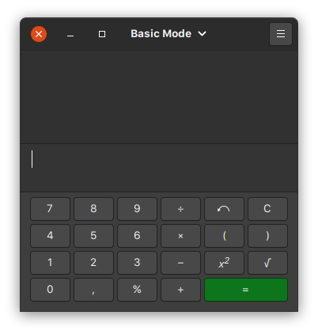

# CSI606 - Sistemas WEB I - SI-06
## Período Letivo Remoto
### Prof. Fernando Bernardes de Oliveira, Ph.D.

---

## **Atividade Prática 1 - valor: 8,0 pontos**

### Instruções/regras

1.  A atividade é **INDIVIDUAL**.

2.  Em caso de caracterização de cópia entre discentes e/ou da internet
    (sem a devida referência), **TODAS AS PESSOAS** envolvidas terão
    **nota zero** (0). Códigos desenvolvidos por pessoas de outros
    semestres também causam a eliminação da atividade.

3.  O conteúdo CSS e JS devem ser criados **separadamente** e associado
    ao HTML apropriadamente.

4.  Você pode também utilizar *frameworks* CSS e JavaScript, desde que
    sejam livres e/ou possuam a devida licença de utilização associada.

5.  **Entrega:**

    - **GitHub**: código-fonte e afins. Insira os arquivos criados na pasta **Atividades/atividade-pratica-01** no seu repositório no GitHub. Crie os nomes dos arquivos HTML conforme indicado em cada questão.

    - Data: **04/11/2021, até 23:59 horas**.

---

### Desenvolvimento

Desenvolva páginas para cada um dos tópicos a seguir utilizando HTML, CSS e Javascript para representar ações/utilidades. Procure utilizar cores e fontes de maneira adequada ao contexto, observando sempre os aspectos de usabilidade e acessibilidade.

#### **01 - Calculadora** *(01-calculadora.html: 2,5 pontos)*

O objetivo desta aplicação é o desenvolvimento de uma calculadora com as quatro operações básicas (pelo menos). O usuário deve clicar nos números e símbolos (e não digitar) para realizar as operações. A [figura abaixo](./img/calculadora-gnome-ubuntu.png) apresenta um exemplo de uma calculadora simples. Observe que ela tem outras operações. A implementação de funcionalidades, além das operações básicas, fica ao seu critério.

---

#### **02 - Controle de PIX** *(02-pix.html: 2,5 pontos)*

O objetivo desta aplicação é controlar as transferências enviadas e recebidas por meio do [PIX](https://www.bcb.gov.br/estabilidadefinanceira/pix). Crie uma interface para permitir que toda a sua movimentação financeira seja controlada.

Você precisa disponibilizar um campo para indicar o tipo da chave (*CPF, CNPJ, e-mail, número de celular ou chave aleatória*) e o valor da chave conforme esse tipo. Além disso, indique o tipo da operação (envio ou recebimento), o valor em reais e a data.

Para a definição dos bancos envolvidos no envio e no recebimento, utilize a seguinte API para carregar os dados das instituições financeiras.

- API disponível em: <https://github.com/BrasilAPI/BrasilAPI>

- *Endpoint*: **Banks**.

Você pode carregar a lista de todos os bancos num combo, por exemplo, ou recuperar os dados a partir do código. Os detalhes de usabilidade ficam ao seu critério.

Quando o usuário clicar, por exemplo, em "Finalizar", a aplicação deverá exibir um resumo contendo o valor total das transações por tipo de operação (envio ou recebimento) e o saldo final (a diferença entre envios e recebimentos).

---

#### **03 - Conversor de moedas** *(03-moedas.html: 3,0 pontos)*

Construa uma interface para realizar a conversão de valores entre moedas. Os campos referentes às moedas (real, dolar, libra, dentre outras), bem como a cotação atual devem ser carregadas por meio de uma API. 

- API disponível em: <https://olinda.bcb.gov.br/olinda/servico/PTAX/versao/v1/documentacao>

- *Endpoint*: verifique na documentação os diferentes *endpoints* para as moedas e as cotações.

Um exemplo de conversor de moedas está disponível [aqui](https://www.bcb.gov.br/conversao).

##### **Desafio** *(3,0 pontos extras)*

Apresente um gráfico com o histórico de cotação da moeda num determinado período. Por exemplo, se a pessoa quiser converter de real (R$) para dólar (US$), além do resultado, apresente um gráfico (linhas, barras, dentre outros) da cotação diária da moeda destino num determinado período (uma semana, 15 dias, um mês, e/ou outros intervalos que você julgar necessário).

Você pode utilizar bibliotecas para a construção do gráfico como a [D3.js](https://d3js.org/) ou a [Chart.js](https://www.chartjs.org/).

---

**Uma excelente atividade para vocês!**

---

> ***One child, one teacher, one book,***  
> ***one pen can change the world.***  
>  
> --- Malala Yousafzai (1997 - ).  
> *Pakistani activist.*  
> *The youngest Nobel Prize laureate (17 years).*  

---