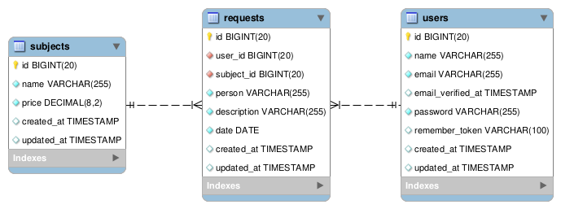

# CSI606 - Sistemas WEB I - SI-06
## Período Letivo Remoto
### Prof. Fernando Bernardes de Oliveira, Ph.D.

---

## **Atividade Prática 2 - valor: 12,0 pontos**

### Instruções/regras

1.  A atividade é **INDIVIDUAL**.

2.  Em caso de caracterização de cópia entre pessoas e/ou da internet (sem a devida referência), **TODOS** os envolvidos terão **nota zero** (0). Códigos utilizados por pessoas de outros semestres também causam a eliminação da atividade.

3.  Os dados devem ser **validados** tanto do lado do **cliente** quanto do lado do **servidor**.

4.  **Entrega:**

    - **GitHub**: código-fonte e afins. Insira os arquivos criados na pasta **Atividades/atividade-pratica-02** no seu repositório no GitHub.
    - Data: **03/01/2022, até 23:59 horas**.

### Desenvolvimento: Sistema de Controle de Protocolos

Os objetivos desta atividade são a construção de interfaces com os usuários (*front-end*) e o estudo da linguagem PHP e do *framework* Laravel (*back-end*) por meio do desenvolvimento de um sistema para controlar protocolos. Este sistema pode ser utilizado em cartórios, escolas, prefeituras e em diferentes repartições públicas. Você pode criar uma aplicação genérica ou especializada para um contexto em particular. 

Crie interfaces personalizadas por meio de CSS para garantir uma experiência amigável ao usuário. Você pode, por exemplo, utilizar o *Bootstrap* de maneira apropriada para agilizar o processo, além de utilizar *templates* livres disponíveis na Internet.

O diagrama do banco de dados é apresentado na [figura abaixo](./img/protocol-model.png). Ele foi criado conforme as convenções definidas pelo **Laravel** e utiliza os tipos de dados padrões. A tabela *users* segue o mesmo modelo definido pelo *framework*. As tabelas de controle não foram incluídas na representação.

Todas as pessoas podem acessar a aplicação e **visualizar** os tipos de protocolos (*subjects*). Entretanto, o protocolo de um pedido só pode ser realizado por um usuário registrado e autenticado na aplicação. No contexto reduzido desta aplicação, o usuário tem o papel de um funcionário que registra o protocolo de uma pessoa. Esses usuários podem também cadastrar os tipos de protocolos, listar as solicitações e os usuários, além de ter um relatório totalizando os requerimentos cadastrados por tipo e por usuário.

Crie **um menu de acesso** na página inicial para cada área e para cada uma das opções (***Área Geral*** e ***Área Administrativa***). Desenvolva os processamentos de acordo com a área de acesso/visão do sistema apresentados a seguir.

### Atividades

Crie um projeto a partir do **Laravel** para o sistema. Realize as configurações necessárias no arquivo [`.env`]. As tabelas devem ser criadas por meio das ***migrations***.

As áreas específicas do sistema devem ser criadas como segue.

#### Página inicial

Crie na página inicial um **menu de acesso** para cada uma das áreas e para cada uma das opções (***Área geral*** e  ***Área administrativa***). Dentro de cada área, crie os *links* para cada uma das opções.

### Área geral

Nesta área, os **tipos de protocolos** podem ser visualizados, sendo apresentados em ordem **ascendente** pelo **nome**.

### Área Administrativa

A **Área Administrativa** é de acesso restrito aos usuários logados na aplicação. Um novo usuário ainda tem a opção de se cadastrar. 

**ATENÇÃO: por questões de simplicidade, o sistema aceitará a inclusão de usuários. Para sistemas em produção, esse processo é realizado somente por pessoas autorizadas.**

As funcionalidades desta área são:

1. **Novo usuário** - realizar cadastro de um novo  usuário. As pessoas podem fazer o registro na aplicação.

2.  **Acesso** à área administrativa - faça o *login* do administrador (tabela *users*).

3. **CRUD dos Tipos de Protocolos**: implemente todas as operações para os tipos dos protocolos. Os tipos **não podem** ser excluídos se tiverem protocolos relacionados. A tabela *subjects* tem a seguinte estrutura.

- `id`: inteiro, autoincremento;
- `name`: texto, tamanho 255, não nulo. Armazena a descrição do tipo do protocolo.
- `price`: decimal, não nulo. Armazena o preço (custo) para esse tipo de protocolo.

4. **CRUD dos Protocolos**: implemente todas as operações para os protocolos. A tabela *requests* tem a seguinte estrutura.

- `id`: inteiro, autoincremento;
- `user_id`: chave estrangeira da tabela `users`. Esse campo armazena o usuário que fez o cadastro do protocolo (usuário logado).
- `subject_id`: chave estrangeira da tabela `subjects`. Esse campo relaciona o tipo do protocolo.
- `person`: texto, tamanho 255, não nulo. Armazena o nome da pessoa que fez o protocolo.
- `description`: texto, tamanho 255, não nulo. Armazena informações adicionais ou complementares ao protocolo.
- `date`: data, não nulo. Armazena a data em que o protocolo foi registrado.

5. Relatório de **protocolos** em **ordem decrescente de data**, e os **tipos dos protocolos em ordem alfabética**. A quantidade de protocolos e o valor total devem ser apresentados ao final do relatório.

6.  Relatório de **usuários** - apresenta uma lista de usuários cadastrados em ordem alfabética pelo campo **nome** (tabela *users*).

---

**Uma excelente atividade para vocês!**

---

***Let's code!***   

> ***What we have to learn to do, we learn by doing.***  
>
> --- Aristóteles.