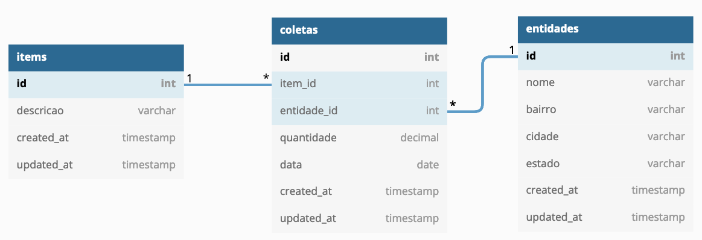

# CSI606 - Sistemas para a WEB I - Prova

## Entrega: **17/06/2022 - Moodle**

### Prof. Fernando Bernardes de Oliveira

---  

## INSTRUÇÕES - Penalizações serão aplicadas caso estas regras não sejam seguidas.  

1. A prova é **INDIVIDUAL**! Em caso de identificação de **CÓPIA**, todos(as) os(as) envolvidos(as) terão nota **ZERO (0,0)**.

2. **Somente será permitida a utilização de códigos produzidos por você ou que sejam livres, devidamente licenciados e disponibilizados publicamente**.

3. As questões consideram a resolução da prova por meio do *framework* [**Laravel**](https://laravel.com/). Caso você utilize outro *framework*, utilize as funcionalidades correspondentes. Não é indicado implementá-las manualmente considerando o tempo disponível.

4. **Atenção para as letras maiúsculas e minúsculas** nos seus códigos e nos nomes dos seus arquivos. As provas são corrigidas em **ambiente UNIX** e, caso isso não seja respeitado, a sua aplicação não funcionará de modo apropriado. Sendo assim, a questão será desconsiderada. ~~Já passou da hora de vocês largarem o windows.~~

5. Você pode utilizar qualquer SGDB. Os parâmetros de conexão dependem da configuração do seu servidor.  

6. O banco de dados foi modelado de acordo com as convenções do *Laravel*. A tabela `users`, além das tabelas de controle do *framework*, não foram incluídas no diagrama, mas elas também fazem parte do banco de dados. Por favor, sigam o modelo que foi definido e não façam alterações na estrutura das tabelas.

7. Crie um arquivo chamado `README.md` (ou `README.txt`) e indique os **aplicativos** e **versões** utilizados: *navegador, PHP/Laravel ou outro framework, Banco de dados* e demais recursos utilizados.

8. Após o término da prova, compacte os arquivos com o nome: `CSI606-2021-02-PROVA-NomeAluna(o)`. **Lembre-se de remover a pasta `vendor` (ou similar)**.

9. O arquivo deverá ser postado no **Moodle** na atividade referente à prova em questão.

10. **Para cada uma das regras desrespeitadas serão descontados 20% do total da prova** ~~Mentira, não desconto não. Mas, não abuse. :stuck_out_tongue_winking_eye:~~

---

## Uma breve introdução

Para a elaboração de provas, geralmente, eu procuro por problemas e aplicações práticas no cotidiano das pessoas. Numa dessas pesquisas, eu me deparei com notícias impactantes. No momento em que redijo este documento (08/06/2022), enfrentamos situações como:

> [Fome no Brasil: número de brasileiros sem ter o que comer quase dobra em 2 anos de pandemia](https://g1.globo.com/economia/noticia/2022/06/08/fome-no-brasil-numero-de-brasileiros-sem-ter-o-que-comer-quase-dobra-em-2-anos-de-pandemia.ghtml)
>> A fome avança cada vez mais rápido pelo Brasil. Um levantamento divulgado nesta quarta-feira (8) mostra que o país soma atualmente cerca de **33,1 milhões de pessoas sem ter o que comer diariamente**, quase o dobro do contingente em situação de fome estimado em 2020.
>> Em números absolutos, são 14 milhões de pessoas a mais passando fome no país.

E os relatos são assustadores:

> ['Fome dói tudo, você chega a sonhar que está comendo', diz homem em situação de rua em SP](https://g1.globo.com/sp/sao-paulo/noticia/2022/06/08/fome-doi-tudo-voce-chega-a-sonhar-que-esta-comendo-diz-homem-em-situacao-de-rua-em-sp.ghtml)
>> Desempregado, Gilberto Souza luta para sobreviver e **conseguir algo para se alimentar ao menos uma vez por dia**.

E o que mais assusta é que as pessoas estão com fome não pela falta de produção de comida, mas para onde essa produção é destinada e como as coisas são tratadas:

> [Recordes no agronegócio e aumento da fome no Brasil: como isso pode acontecer ao mesmo tempo?](https://g1.globo.com/economia/agronegocios/noticia/2021/08/11/recordes-no-agronegocio-e-aumento-da-fome-no-brasil-como-isso-pode-acontecer-ao-mesmo-tempo.ghtml)
>>Especialistas explicam que a produção brasileira é focada em itens para exportação, como soja e milho. Por outro lado, **a remuneração pelo cultivo de alimentos da cesta básica caiu para o produtor por causa do empobrecimento da população.**

Se considerarmos que o Brasil tem 210 milhões de habitantes, temos, aproximadamente, 16% da população passando **fome**! Isso é inaceitável! Na mesma proporção, numa sala de aula com 40 pessoas, cerca de 6 estudantes passam fome!

**Precisamos fazer alguma coisa. Se vocês souberem de entidades ou campanhas que coletam alimentos e agasalhos, por favor, avisem para que possamos divulgar e ajudar também.**

Esse breve relato (e desabafo) não têm relação com a disciplina ou com a prova diretamente. Vamos ao nosso conteúdo.

---

## PRÁTICA - Sistema de Controle de Doação de Alimentos e Agasalhos

O objetivo deste sistema é registrar e controlar o recebimento de doações e a coleta de alimentos e agasalhos por entidades. O diagrama do banco de dados é apresentado na figura abaixo e foi construído utilizando o [dbdiagram.io](https://dbdiagram.io/home).

Considerando o tempo da prova, algumas questões foram simplificadas. Por exemplo, as cidades e os estados poderiam ser cadastrados em outras tabelas e uma relação ser criada com a tabela de `entidades`. Contudo, optei por não fazer assim. Além disso, o escopo foi reduzido conforme o contexto. [~~me julguem~~](https://youtu.be/rDiQCrIDSyA)

As tabelas são representadas da seguinte maneira. Considere, além dos campos descritos, as colunas de *timestamps* do Laravel.

- `items`: descrição dos itens que podem ser arrecadados (*observe que a definição segue a convenção e o nome não é itens*).

    1. `id`: identificador inteiro, autoincremento, chave primária.

    2. `descricao`: texto com 100 caracteres. Representa a descrição dos itens: pacote de arroz 5kg, pacote feijão 1kg, camisa, bermuda, dentre outros.

- `entidades`: dados das entidades que arrecadam os itens.

    1. `id`: identificador inteiro, autoincremento, chave primária.

    2. `nome`: texto com 100 caracteres. Representa o nome da pessoa.

    3. `bairro`: texto com 100 caracteres. Representa o bairro da pessoa.

    4. `cidade`: texto com 100 caracteres. Representa o nome da cidade da pessoa.

    5. `estado`: texto com 02 caracteres. Representa a sigla do estado da pessoa.

- `coletas`: relaciona as entidades com os itens, indicando a quantidade recebida e a data em que o item foi coletado.

    1. `id`: identificador inteiro, autoincremento, chave primária.

    2. `item_id`: identificador inteiro, chave estrangeira da tabela `items`, campo `id`.

    3. `entidade_id`: inteiro, chave estrangeira da tabela `entidades`, campo `id`.

    4. `quantidade`: decimal (*float* ou similar). Representa a quantidade de itens recebidos. Podem ser valores inteiros, como 10 camisas, mas também decimais, como 22,5 kg de batatas.

    5. `data`: tipo data. Representa a data em que o item foi recebido/coletado.

---

### Visões

A aplicação possui duas visões principais, além da página inicial. A **área geral** é utilizada para apresentar o total de doações recebidas por entidade, bem como a quantidade de cada item.

A **área administrativa** é utilizada pelas pessoas das entidades, os quais recebem as doações e fazem os registros das coletas. Essa área é protegida por autenticação, e suas funcionalidades só podem ser acessadas por usuários válidos.

Desenvolva as seguintes atividades a seguir, considerando o contexto e as áreas de acesso/visão do sistema apresentados.

---  

## 1. Preparação da aplicação e do banco de dados (**5 pontos**)

Para a configuração da aplicação e do banco de dados, defina os seguintes elementos de maneira apropriada.

1. Defina o arquivo de configuração do ambiente \[`.env`\], considerando o banco de dados utilizado e as demais variáveis. (**1 ponto**)

1. Defina os *migrations* para cada uma das tabelas observando os relacionamentos. (**2 pontos**)

1. Defina as *factories* para cada uma das tabelas. Utilize o *faker* e os formatadores adequados para a geração de dados aleatórios. (**1 ponto**)

1. Os *Models*, os *Controllers* e as *Views* também devem ser criados de para cada uma das funcionalidades. (**1 ponto**)

---  

## 2. Página inicial (**1 ponto**)

Crie uma página inicial com um **menu de acesso** para cada uma das áreas e para cada uma das opções (**Área geral** e **Área administrativa**). As validações e as correções da prova serão realizadas a partir desse menu e não por meio do acesso aos arquivos gerados.

---

## 3. Área Geral (**3 pontos**)  

A área geral apresenta o total de doações recebidas por entidade, bem como a quantidade de cada item. Ela é uma interface apenas de consulta.

1. **Total geral de doações recebidas**: apresente o número total de doações recebidas por entidade. Você pode apresentar o nome da entidade e o total dos itens coletados. Se a entidade recebeu, por exemplo, 10 camisas e 5 pacotes de arroz, devem ser contabilizados 15 itens coletados. Além disso, apresente o total geral. Veja um exemplo com dados aleatórios. Os nomes da entidades foram retirados [daqui](https://viagemegastronomia.cnnbrasil.com.br/noticias/conheca-ongs-que-ajudam-no-combate-a-fome-no-brasil-e-saiba-como-colaborar/). Existem mais projetos lá.

    | Entidade          | Itens      |
    | ----------------- | ---------: |
    | [Ação da Cidadania](https://www.instagram.com/acaodacidadania/) |        10.253,72 |
    | [Banco de Alimentos](https://www.instagram.com/ongbancodealimentos/)      |        9.843,98 |
    | [Tem Gente com Fome](https://www.instagram.com/temgentecomfomeoficial/) |       12.759,25 |
    | **TOTAL GERAL**   |  **32.856,95** |

1. **Total de itens recebidos**: apresente a quantidade de itens recebidos. Veja um exemplo com dados aleatórios:

    | Item              | Quantidade     | Porcentagem |
    | ----------------- | -------------: | ----------: |  
    | Arroz             |      10.327,85 |      31,43% |
    | Batata            |       4.693,40 |      14,28% |
    | Bermuda           |       3.985,00 |      12,13% |
    | Camisa            |       5.387,00 |      16,40% |
    | Feijão            |       8.463,70 |      25,76% |
    | **TOTAL GERAL**   |  **32.856,95** | **100,00%** |

---

## 4. Área Administrativa (**11 pontos**)

Esta área possui as seguintes funcionalidades e elas só podem ser acessadas por **usuários autenticados**.

1. **Login**: implemente o processo de autenticação dos usuários. (**1 ponto**)

1. **Itens**:  

    - 2.1. **Relatório**: implemente uma interface para apresentar todos os dados dos itens cadastrados em ordem alfabética. (**1,5 ponto**)

    - 2.2. **Cadastro**: implemente o cadastro (apenas) de itens. (**1,5 ponto**)

1. **Entidades**:  

    - 3.1. **Relatório**: implemente uma interface para apresentar todos os dados das entidades cadastradas em ordem alfabética. (**1,5 ponto**)

    - 3.2. **Exclusão**: implemente a exclusão dos dados (apenas) das entidades. Entidades que já foram utilizadas nas coletas não podem ser excluídas. (**1,5 ponto**)

1. **Coletas**:  

    - 4.1 **CRUD completo**: implemente a listagem, a inclusão, a alteração e a exclusão das coletas dos itens. (**4 pontos**)

Quem implementar o CRUD de todas as tabelas ganhará uma surpresa! ~~Um [parabéns](https://youtu.be/rrDh77Bmny0)! Não, pera.~~

---

## Recados finais ~~da paróquia~~

**Lembre-se:**

- ''A [documentação](https://laravel.com/docs) é o meu guia, e nada me faltará.'' [Laravel 9:2]

- Se você tiver qualquer dúvida ou problema, entre em contato. Não sofra absolutamente só. Estamos juntos nessa! :fist_oncoming: #tmj

- Faça as implementações com calma e sem se apavorar! Temos muito tempo.

- Cuide da sua saúde mental! Beba água, faça alguma atividade física (maratonar séries não conta, infelizmente), respira e vai!

- Estou preocupado apenas que vocês aprendam! A nota tem pouca importância.

**Uma excelente prova para vocês!**

---

> *"Aqueles que passam por nós, não vão sós, não nos deixam sós.*  
> *Deixam um pouco de si, levam um pouco de nós."*  
> --- Antoine de Saint-Exupéry (1900 - 1944).

---
