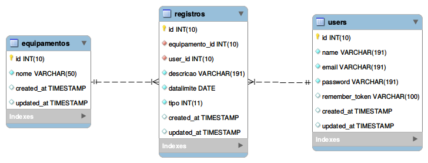

# CSI606 - Sistemas WEB I - SI-06

## Período Letivo 2021/2

### Prof. Fernando Bernardes de Oliveira, Ph.D.

---

## **Atividade Prática 2 - valor: 15,0 pontos**

### Instruções/regras

1. A atividade é **INDIVIDUAL**.

2. Em caso de caracterização de cópia entre pessoas e/ou da internet (sem a devida referência), **TODOS** os envolvidos terão **nota zero** (0). Códigos utilizados por pessoas de outros semestres também causam a eliminação da atividade.

3. Os dados devem ser **validados** tanto do lado do **cliente** quanto do lado do **servidor**.

4. **Entrega:**

    - **GitHub**: código-fonte e afins. Insira os arquivos criados na pasta **Atividades/atividade-pratica-02** no seu repositório no GitHub.
    - Data: **13/06/2022, até 23:59 horas**.

### Desenvolvimento:  Sistema de Manutenção de Equipamentos

Os objetivos desta atividade são a construção de interfaces com os usuários (*front-end*) e o estudo da linguagem PHP e do *framework* Laravel (*back-end*) por meio da construção de um sistema para controlar os registros para manutenção de equipamentos. Este sistema pode ser utilizado em diferentes segmentos. Além disso, esses equipamentos podem ser os mais diversos possíveis, como computadores, impressoras, veículos, máquinas industriais, dentre outros.

Crie interfaces personalizadas por meio de CSS para garantir uma experiência amigável ao usuário. Você pode, por exemplo, utilizar o *Bootstrap* de maneira apropriada para agilizar o processo, além de utilizar *templates* livres disponíveis na Internet.

O diagrama do banco de dados é apresentado na [figura abaixo](../img/sistema-manutencao.png). Ele foi criado conforme as convenções definidas pelo **Laravel** e utiliza os tipos de dados padrões. A tabela *users* segue o mesmo modelo definido pelo *framework*. As tabelas de controle não foram incluídas na representação.

A aplicação possui duas visões principais, além da página inicial. A **área geral** é utilizada pela equipe de **suporte** responsável pela manutenção. A **área administrativa** é utilizada por usuários que fazem os **cadastros** dos equipamentos e das manutenções.

Todos os usuários da aplicação podem **visualizar** os equipamentos e as manutenções cadastradas. Entretanto, os cadastros só podem ser realizados pelos administradores do sistema, os quais devem efetuar o acesso (*login*) para concluir a ação. O administrador do sistema pode cadastrar os equipamentos e manutenções, listar os registros e os usuários, além de ter um relatório totalizando as manutenções por equipamento.

### Atividades

Crie um projeto a partir do **Laravel** para o sistema. Realize as configurações necessárias no arquivo [`.env`]. As tabelas devem ser criadas por meio das ***migrations***. *Você pode utilizar outra tecnologia além do Laravel, seguindo as mesmas considerações e funcionalidades descritas na atividade.*

As áreas específicas do sistema devem ser criadas como segue.

#### Página inicial

Crie na página inicial um **menu de acesso** para cada uma das áreas e para cada uma das opções (***Área geral - Suporte*** e ***Área administrativa***). Dentro de cada área, crie os *links* para cada uma das opções.

### Área geral - Suporte

A equipe de suporte tem acesso a dois relatórios.

1. **Lista de equipamentos**: crie um relatório para apresentar os equipamentos cadastrados em ordem alfabética pelo campo **nome** (tabela *equipamentos*).

2. **Manutenções cadastradas para os equipamentos**: crie um relatório para apresentar essas manutenções (tabela *registros*), incluindo as seguintes informações em ordem **ascendente** de **data** (*datalimite*). Utilize, por exemplo, uma tabela para a construção do relatório.

    1. Data limite (*registros.datalimite*);

    2. Nome do equipamento (*equipamentos.nome*);

    3. Nome do usuário (*users.name*);

    4. Tipo da manutenção (*registros.tipo*, observando que 1 -
        Preventiva, 2 - Corretiva, 3 - Urgente);

    5. Descrição da manutenção/problema (*registros.descricao*);

### Área Administrativa

A **Área do Administrador** é de acesso restrito. Assim, ele deve efetuar o *login* no sistema informando seu usuário (*email*) e sua senha (*password*) (tabela *users*).

As funcionalidades desta área são descritas a seguir. As duas primeiras opções devem ser apresentadas caso o usuário não esteja logado. As demais opções devem ser exibidas após o *login* e **não podem** ser acessadas sem essa ação.

**ATENÇÃO: por questões de simplicidade, o sistema aceitará a inclusão de usuários. Para sistemas em produção, esse processo é realizado somente por pessoas autorizadas.**

1. **Novo usuário** - realizar cadastro de um novo usuário/administrador. As pessoas podem fazer o registro no sistema.

2. **Acesso** à área do administrador - faça o *login* do administrador (tabela *users*).

3. **CRUD dos Equipamentos**: implemente todas as operações para os equipamentos. A exclusão só será permitida caso não existam manutenções cadastradas para o equipamento.

4. **CRUD das Manutenções**: implemente todas as operações para as manutenções. Não existe restrição para a exclusão. Os tipos para as manuteções são: 1 - Preventiva, 2 - Corretiva, 3 - Urgente.

5. Relatório de **usuários** - apresenta uma lista de usuários cadastrados em ordem alfabética pelo campo **nome** (tabela *users*).

6. Relatório de **manutenções** - crie um relatório agrupando todas manutenções por equipamento. Você precisar lista o equipamento e todas as manutenções cadastradas para ele, além de indicar a quantidade de registros associados.

---

**Uma excelente atividade para vocês!**

---

***Let's code!***

> ***What we have to learn to do, we learn by doing.***  
>
> --- Aristóteles.
