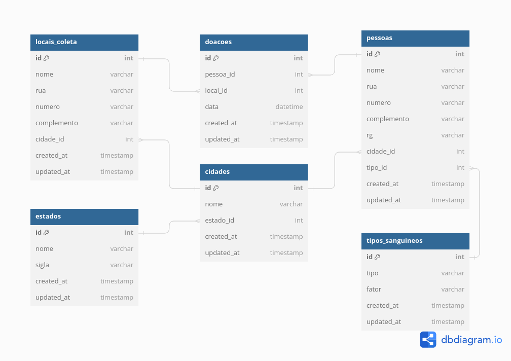

# CSI606 - Sistemas WEB I - SI-06

## Período Letivo 2023/2

### *Prof. Fernando Bernardes de Oliveira, Ph.D.*

---

## **Atividades Práticas**

### Instruções/regras

1. As atividades são **INDIVIDUAIS**.

1. Em caso de caracterização de cópia entre pessoas e/ou da internet (sem a devida referência), **TODOS** os envolvidos terão **nota zero** (0). Códigos utilizados por pessoas de outros semestres também causam a eliminação da atividade.

1. **Entrega:**

    - **GitHub**: código-fonte e afins. Insira os arquivos criados nas pastas conforme a entrega no seu repositório no GitHub.  
        = **Atividades/atividade-pratica/sever**  
        = **Atividades/atividade-pratica/web**  
    - As datas para as entregas estão disponíveis no Moodle.

## Desenvolvimento: Sistema de Agendamento de Doação de Sangue

O objetivo deste sistema é controlar o processo de agendamento de doação de sangue numa determina instituição. O diagrama do banco de dados completo é apresentado na [figura abaixo](./database-model/CSI606-sistema-doacao-sangue.png). Você também pode acessar o modelo definido a partir do [DBDiagram](https://dbdiagram.io/d/CSI606-sistema-doacao-sangue-630d077e0911f91ba5ecf743).

Este modelo será utilizado para as duas atividades práticas. O escopo de cada atividade será definido apropriadamente.

---

## **Atividade Prática 1**

No caso da **Atividade 1** é esperado que vocês desenvolvam uma *API RESTful* para as seguintes entidades: *tipos_sanguineos*, *pessoas*, *locais_coleta* e *doacoes*. Vocês pode utilizar o desenvolvimento de *estados* e *cidades* que será realizado em sala de aula. Considere as seguintes operações:

- Inserir - *create*
- Atualizar - *update*
- Excluir - *delete*
- Recuperar - *read* - todos os itens, por *id* e por *nome* (quando se aplicar).

É sugerido que vocês utilizem **Node.js com TypeScript** para esse desenvolvimento. Contudo, isso não é necessário. Vocês podem, inclusivem, utilizar outas tecnologias às suas preferências. É sugerido também que vocês estudem outras arquiteturas de software, além da estrutura que foi utilizada.

Sintam-se livres para as escolhas e documentem, por gentileza, utilizando o **README.md** das suas respectivas atividades, as tecnologias, as arquiteturas, os passos para execução e demais itens que julgarem importantes.

---

## **Atividade Prática 2**

A Atividade Prática 2 consiste na implementação da interface Web (em *Next.js/React.js* ou outro *framework* de sua preferência) das entidades indicadas na **Atividade Prática 1**.

Sigam, por gentileza, as mesmas recomendações e considerações indicadas na primeira atividade.  

---

**Uma excelente atividade para vocês!**

---

***Let's code!***

> ***What we have to learn to do, we learn by doing.***  
>
> --- Aristóteles.
