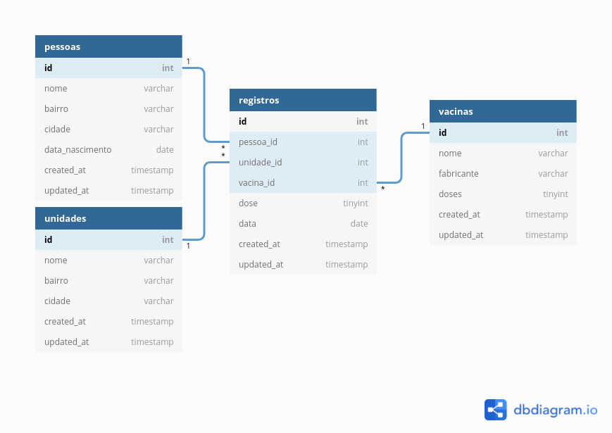

# CSI606 - Sistemas para a WEB I - Prova

## Entrega: **03/01/2022 - Moodle**

### Prof. Fernando Bernardes de Oliveira

---  

## INSTRUÇÕES - Penalizações serão aplicadas caso estas regras não sejam seguidas.  

1. A prova é **INDIVIDUAL**! Em caso de identificação de **CÓPIA**, todos(as) os(as) envolvidos(as) terão nota **ZERO (0,0)**.

2. **Somente será permitida a utilização de códigos produzidos por você ou que sejam livres, devidamente licenciados e disponibilizados publicamente**.

3. As questões consideram a resolução da prova por meio do *framework* [**Laravel**](https://laravel.com/). Caso você utilize outro *framework*, utilize as funcionalidades correspondentes. Não é indicado implementá-las manualmente considerando o tempo disponível.

4. **Atenção para as letras maiúsculas e minúsculas** nos seus códigos e nos nomes dos seus arquivos. As provas são corrigidas em **ambiente UNIX** e, caso isso não seja respeitado, a sua aplicação não funcionará de modo apropriado. Sendo assim, a questão será desconsiderada. ~~Já passou da hora de vocês largarem o windows.~~

5. Você pode utilizar qualquer SGDB. O banco de dados foi modelado de acordo com as convenções do *Laravel*. Os parâmetros de conexão dependem da configuração do seu servidor.  

6. A tabela `users`, além das tabelas de controle do *framework*, não foram incluídas no diagrama, mas elas também fazem parte do banco de dados.

7. Crie um arquivo chamado `README.md` (ou `README.txt`) e indique os **aplicativos** e **versões** utilizados: *navegador, PHP/Laravel ou outro framework, Banco de dados* e demais recursos utilizados.

8. Após o término da prova, compacte os arquivos com o nome: `CSI606-2021-01-remoto-PROVA-NomeAluna(o)`. **Lembre-se de remover a pasta `vendor` (ou similar)**.

9. O arquivo deverá ser postado no **Moodle** na atividade referente à prova em questão.

10. **Para cada uma das regras desrespeitadas serão descontados 20% do total da prova** ~~Mentira, não desconto não. Mas, não abuse. :stuck_out_tongue_winking_eye:~~

---

## PRÁTICA - Sistema de Controle de Vacinação contra a COVID-19

O objetivo deste sistema é registrar e controlar as vacinas contra a COVID-19 aplicadas nas pessoas. O diagrama do banco de dados é apresentado na figura abaixo. **Muito obrigado à Gisela Lourenço e ao Samuel Souza pela indicação das aplicações para geração do diagrama E-R.** Eu ~~apanhei menos~~ me adaptei melhor ao [dbdiagram.io](https://dbdiagram.io/home).

Considerando o tempo da prova, algumas questões foram simplificadas. Por exemplo, as cidades e os estados poderiam ser cadastradas em outras tabelas e uma relação ser criada com as tabelas de `pessoas` e `unidades`. Mas, optei por não fazer assim. Além disso, o escopo foi reduzido conforme o contexto. [~~me julguem~~](https://youtu.be/rDiQCrIDSyA)

As tabelas são representadas da seguinte maneira. Considere, além dos campos descritos, as colunas de *timestamps* do Laravel.

- `pessoas`: cadastro das pessoas que serão vacinadas.

    1. `id`: identificador inteiro, autoincremento, chave primária.

    2. `nome`: texto com 100 caracteres. Representa o nome da pessoa.

    3. `bairro`: texto com 100 caracteres. Representa o bairro da pessoa.

    4. `cidade`: texto com 100 caracteres. Representa o nome da cidade da pessoa.

    5. `estado`: texto com 02 caracteres. Representa a sigla do estado da pessoa.

    6. `data_nascimento`: data de nascimento da pessoa. Em condições normais de temperatura e pressão, desprezando o atrito, a data é gravada no formato `'YYYY-MM-DD'`. Como isso pode depender do SGBD que você utilizar, eu sugiro que você verifique isso.

    7. `cpf`: texto com 11 caracteres. Representa a CPF da pessoa (apenas os números).

- `vacinas`: imunizantes utilizados e os seus respectivos fabricantes.

    1. `id`: identificador inteiro, autoincremento, chave primária.

    2. `nome`: texto com 100 caracteres. Representa o nome da vacina (CoronaVac, AstraZeneca, SpiN-Tec, Sputnik, Janssen, [Pfizer](https://www.instagram.com/tv/CP58ByuHWar/), dentre outras).

    

    3. `fabricante`: texto com 100 caracteres. Representa o nome do fabricante da vacina.

    4. `pais`: texto com 100 caracteres. Representa o país do fabricante da vacina.

    5. `doses`: inteiro com menor precisão (*tinyInt* ou similar). Representa a quantidade de doses recomendadas para a vacina.

- `unidades`: locais em que as vacinas são aplicadas: postos de saúde, hospitais, pontos especiais de campanha, dentre outros.

    1. `id`: identificador inteiro, autoincremento, chave primária.

    2. `nome`: texto com 100 caracteres. Representa o nome do local (como, por exemplo, Hospital A, Posto de Saúde B, Centro de Saúde C, e assim por diante).

    3. `bairro`: texto com 100 caracteres. Representa o bairro da unidade.

    4. `cidade`: texto com 100 caracteres. Representa o nome da cidade da unidade.

    5. `estado`: texto com 02 caracteres. Representa a sigla do estado da unidade.

- `registros`: relaciona as pessoas com as unidades de saúde e a vacina utilizada, indicando a dose e a data que o imunizante foi aplicado.

    1. `id`: identificador inteiro, autoincremento, chave primária.

    2. `pessoa_id`: identificador inteiro, chave estrangeira da tabela `pessoa`, campo `id`.

    3. `unidade_id`: inteiro, chave estrangeira da tabela `unidade`, campo `id`.

    4. `vacina_id`: inteiro, chave estrangeira da tabela `vacinas`, campo `id`.

    5. `dose`: inteiro com menor precisão (*tinyInt* ou similar). Representa a dose da vacina aplicada: 1, 2, 3, ... Para vacinas de dose única, considere como 0.

    6. `data`: tipo data. Representa a data da aplicação da vacina.

---

### Visões

A aplicação possui duas visões principais, além da página inicial. A **área geral** é utilizada para apresentar o total de pessoas imunizadas, bem como a quantidade de cada vacina utilizada.

A **área administrativa** é utilizada pelas pessoas da área da saúde (#VIVAoSUS), os quais visualizam as informações e fazem os **registros** de vacinação. Essa área é protegida por autenticação, e suas funcionalidades só podem ser acessadas por usuários válidos.

Desenvolva as seguintes atividades a seguir, considerando o contexto e as áreas de acesso/visão do sistema apresentados.

---  

## 1. Preparação da aplicação e do banco de dados (*7 pontos*)

Para a configuração da aplicação e do banco de dados, defina os seguintes elementos de maneira apropriada. 

1. Defina o arquivo de configuração do ambiente \[`.env`\], considerando o banco de dados utilizado e as demais variáveis. (**1 ponto**)

1. Defina os *migrations* para cada uma das tabelas observando os relacionamentos. (**2 pontos**)

1. Defina as *factories* para cada uma das tabelas. Utilize o *faker* e os formatadores adequados para a geração de dados aleatórios. (**2 pontos**)

1. Os *Models*, os *Controllers* e as *Views* também devem ser criados de para cada uma das funcionalidades. (**2 pontos**)

---  

## 2. Página inicial (**1 ponto**)

Crie uma página inicial com um **menu de acesso** para cada uma das áreas e para cada uma das opções (**Área geral** e **Área administrativa**). As validações e as correções da prova serão realizadas a partir desse menu e não por meio do acesso aos arquivos gerados.

---

## 3. Área Geral (**3 pontos**)  

A área geral apresenta o total geral de pessoas imunizadas e a quantidade utilizada de cada vacina. Ela é uma interface apenas de consulta.

1. **Total geral vacinadas aplicadas**: apresente o número total de vacinas aplicadas nas pessoas. Você pode apresentar quantas pessoas foram vacinadas em dose única, primeira e segunda dose, além do total geral. Veja um exemplo com dados aleatórios:

    | Aplicação         | Quantidade |
    | ----------------- | ---------: |
    | Dose única        |        325 |
    | Primeira Dose     |       1986 |
    | Segunda Dose      |        936 |
    | **TOTAL GERAL**   |  **3.247** |

Por simplicidade, eu considerei a quantidade de vacinas e não pessoas. Como têm situações com mais de uma dose, as duas tabelas apresentariam valores distintos e poderiam gerar confusão.  

1. **Total de aplicações por vacinas**: apresente a quantidade de aplicações para cada uma das vacinas utilizadas. Veja um exemplo com dados aleatórios:

    | Vacina            | Quantidade | Porcentagem |
    | ----------------- | ---------: | ----------: |  
    | AstraZeneca       |        324 |       9,98% |
    | CoronaVac         |      1.648 |      50,75% |
    | Janssen           |        325 |      10,01% |
    | Pfizer            |        950 |      29,26% |
    | **TOTAL GERAL**   |  **3.247** | **100,00%** |

---

## 4. Área Administrativa (**19 pontos**)

Esta área possui as seguintes funcionalidades e elas só podem ser acessadas por usuários autenticados.

1. **Login**: implemente o processo de autenticação dos usuários. (**1 ponto**)

1. **Pessoas**:  

    - 2.1. **Relatório**: implemente uma interface para apresentar todos os dados das pessoas cadastradas em ordem alfabética. (**1,5 ponto**)

    - 2.2. **Cadastro**: implemente o cadastro (apenas) de pessoas. (**2 pontos**)

1. **Vacinas**:  
  
    - 3.1. **Relatório**: implemente uma interface para apresentar todos os dados das vacinas cadastradas em ordem alfabética. (**1,5 ponto**)
  
    - 3.2. **Alteração**: implemente a alteração (apenas) de vacinas. (**2 pontos**)

1. **Unidades**:  

    - 4.1. **Relatório**: implemente uma interface para apresentar todos os dados das unidades cadastradas em ordem alfabética. (**1,5 ponto**)

    - 4.2. **Exclusão**: implemente a exclusão dos dados (apenas) das unidades. Unidades que já foram utilizadas nos registros não podem ser excluídas. (**2 pontos**)

1. **Registros**:  

    - 5.1 **CRUD completo**: implemente a listagem, a inclusão, a alteração e a exclusão dos registros de vacinação. (**7,5 pontos**)

Quem implementar o CRUD de todas as tabelas ganhará uma surpresa! ~~Um [parabéns](https://youtu.be/rrDh77Bmny0)! Não, pera.~~

---

## Recados finais ~~da paróquia~~

**Lembre-se:**

- ''A [documentação](https://laravel.com/docs) é o meu guia, e nada me faltará.'' [Laravel 8:65]

- Se você tiver qualquer dúvida ou problema, entre em contato. Não sofra absolutamente só. Estamos juntos nessa! :fist_oncoming: #tmj

- Faça as implementações com calma e sem se apavorar! Temos muito tempo.

- Cuide da sua saúde mental! Beba água, faça alguma atividade física (maratonar séries não conta,infelizmente), respira e vai!

- Estou preocupado apenas que vocês aprendam! A nota tem pouca importância.

**Uma excelente prova para vocês!**

---

> *"Aqueles que passam por nós, não vão sós, não nos deixam sós.*  
> *Deixam um pouco de si, levam um pouco de nós."*  
> --- Antoine de Saint-Exupéry (1900 - 1944).

---
