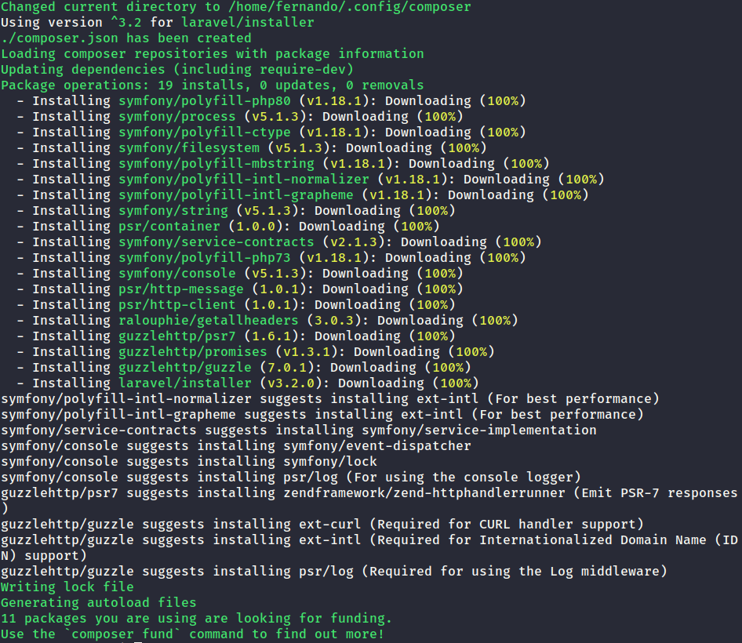
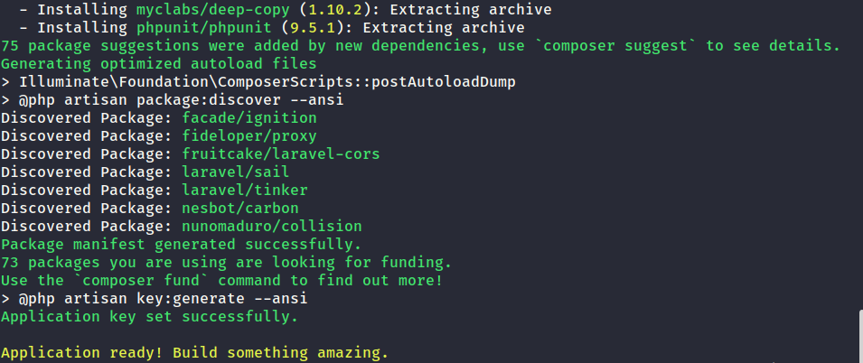

# Preparação do ambiente de desenvolvimento

## Considerações iniciais 

Este documento apresenta uma sugestão de ambiente de desenvolvimento para utilização na disciplina. As pessoas têm total autonomia para escolher outros sistemas operacionais, editores, bem como suas extensões, servidores e demais itens.

Nós precisaremos das seguintes ferramentas para o desenvolvimento das atividades:

- Um editor;
- A linguagem PHP;
- O *framework* Laravel;
- Um servidor de banco de dados relacional.

Nós utilizaremos o [PHP](https://www.php.net/) para desenvolvimento *backend* e o [Laravel](https://laravel.com/), um *framework* [MVC](https://en.wikipedia.org/wiki/Model%E2%80%93view%E2%80%93controller) para aplicações Web. Se você tem dúvidas sobre a utilidade dessa linguagem, eu sugiro que você assista [esta série de vídeos](https://youtu.be/H43fXodv6WY). E mais importante ainda que isso: linguagens são apenas meios e ferramentas para resolvermos os problemas. ***Não tenha apego por suas linguagens e seus frameworks***! Hoje, elas podem ser as mais utilizadas, mas logo elas podem se tornar apenas código legado.

Para o **trabalho final**, outras linguagens e outros *frameworks* podem ser utilizados. A sugestão é que sejam empregadas tecnologias diferentes daquelas que você já conhece/domina. Assim, você ampliará o seu conhecimento e o seu currículo.

## Sistema operacional

Se você observar alguma pesquisa de [*market share* dos servidores web](https://news.netcraft.com/archives/category/web-server-survey/), identificará que a maioria é baseada em sistemas UNIX (alguma distribuição Linux, principalmente). Isso pode ser justificado pelo tipo de licença (custo) das aplicações tanto para quem precisa hospedar alguma aplicação quanto para quem provê o serviço.

Como o sistema baseado em UNIX **difere entre maiúsculas e minúsculas** para o nome de arquivos, o que não acontece no Windows, ao implantar a aplicação nesses servidores, diversos problemas podem ocorrer. Por exemplo, no Laravel (e em diversos outros *frameworks*) é empregado o processo de [**Autoloader**](https://www.php-fig.org/psr/psr-4/), em que o arquivo que contém uma classe é carregado automaticamente sem precisar utilizar explicitamente `include` ou similares. Se o nome de uma classe for definido como `StudentController` e o nome do arquivo como `studentcontroller.php`, no Windows você não terá nenhum problema, e sua aplicação irá funcionar normalmente. Entretanto, no ambiente UNIX, a aplicação não funciona, pois é esperado um arquivo com o nome `StudentController.php`. 

Além disso, ambientes Linux possuem gerenciadores de pacotes nativos, o que facilita a instalação e a configuração. Eu descobri recentemente que existe uma aplicação externa para o ambiente Windows, o [Chocolatey](https://chocolatey.org/). Entretanto, eu nunca utilizei esse gerenciador e também não sei se ele consegue resolver conflitos e a falta de dependências nas instalações. Quem já utilizou esse gerenciador, por favor, compartilhe a experiência.

Essas considerações não são tentativas de doutrinação Linux (por mais que possa parecer :smile:). Sinta-se livre para utilizar o sistema operacional que for mais conveniente. De todo modo, eu sugiro que você também avalie a possibilidade de utilizar alguma distribuição Linux para desenvolvimento, principalmente Web. [Escolha uma distribuição qualquer](https://distrowatch.com/) e prepare o seu ambiente. 

Segue uma sugestão de vídeo para ajudar na configuração do Ubuntu: [Fabio Akita - O Guia DEFINITIVO de UBUNTU para Devs Iniciantes](https://youtu.be/epiyExCyb2s). Em outros canais do [YouTube](https://www.youtube.com/), você encontrará também diversos tutoriais para diferentes distribuições.

## Editor

O editor que eu irei utilizar na disciplina neste período é o [VS Code](https://code.visualstudio.com). Ele tem instalação para Windows, Linux e Mac, além de diversas extensões que auxiliam no desenvolvimento.

Faça o download conforme a sua plataforma e instale o editor. O processo é simples e você não terá problemas com isso (~~nunca se sabe~~).

### Extensões

Eu vou sugerir alguns complementos para serem instalados no editor. No decorrer da disciplina outros podem ser adicionados. Além disso, você também pode contribuir indicando outras instalações.

Verifique sobre o processo de instalação das extensões, bem como sobre o *marketplace* em [Extension Marketplace](https://code.visualstudio.com/docs/editor/extension-gallery).

- **Auto Complete Tag** (Jun Han): esta extensão é um pacote que instala os seguintes complementos: 
    - **Auto Close Tag**: insere automaticamente a tag de fechamento em HTML/XML. Se você digitar `<div>`, é inserido automaticamente `</div>`.

    - **Auto Rename Tag**: permite renomear os pares de tags HTML ao mesmo tempo. Por exemplo, se você quiser mudar um par `<p></p>` para `<div></div>`, quando você alterar o início de `<p>` para `<div>`, o fechamento também é alterado para `</div>`.

- **Bracket Pair Colorizer 2** (CoenraadS
): esta extensão ajuda a identificar por meio de cores diferentes os pares de colchetes, parênteses e chaves. 

- **Live Server** (Ritwick Dey): um servidor web local é iniciado e permite a visualização de páginas HTML. Isso é útil para desenvolvimento *frontend* em  projetos menores.

- **Live Share** (Microsoft): permite o desenvolvimento entre pessoas de modo remoto e colaborativo. Isso pode ser útil para ajudar a resolver as dúvidas de código nos atendimentos. 

Algumas extensões apresentam funcionalidades adicionais e visuais, como cores, ícones e demais itens. Seguem algumas delas:

- **Color Highlight** (Sergii Naumov): esta extensão destaca as cores utilizadas em documentos CSS/HTML.

- **Dracula Official** (Dracula Theme): tema de cores mais agradáveis e menos cansativa para o editor.

- **GitLens** (Eric Amodio): funcionalidades adicionais para o Git.

- **Material Icon Theme** (Philipp Kief): muda os ícones dos arquivos conforme o seu tipo (css, php, html, dentre outros).

Existem diversas extensões para HTML, CSS, PHP e demais *frameworks*. Durante o andamento do curso, podemos instalar esses complementos, bem como, vocês podem indicar as suas preferidas.

## Servidores, linguagens e *frameworks*

As instalações descrita nesta seção se referem ao desenvolvimento *backend*. Nós precisaremos de um servidor HTTP e a linguagem utilizada, um servidor de banco de dados e o *framework* para desenvolvimento.

Para o servidor HTTP, a linguagem e o servidor de banco de dados, você pode instalá-los a partir de pacotes como o [XAMPP](https://sourceforge.net/projects/xampp/), [WAMP](https://sourceforge.net/projects/wampserver/) ou similares.

Um servidor HTTP independente, como o Apache, não é obrigatório. Você pode utilizar o [servidor embutido no PHP](https://www.php.net/manual/en/features.commandline.webserver.php). 

### PHP

**Se você utilizou o XAMPP e a sua versão está correta, você não precisa fazer a instalação do PHP separadamente (Etapa 1). Verifique apenas o funcionamento a partir a linha de comando pelo terminal (Etapa 2).**

#### Instalação

O PHP pode ser instalado no Windows a partir das distribuições disponíveis [aqui](https://windows.php.net/). Veja sobre a instalação [aqui](https://phptherightway.com/#windows_setup).

No Linux, você pode instalá-lo a partir do gerenciador de pacotes da sua distruição (apt, pacman ou similares.).

**Você pode utilizar a versão 7.4 para instalação.**

#### Verificação da linha de comando e versão

Para verificar a instalação e a versão disponível, digite o seguinte comando no seu terminal:

```
php --version
```

Você terá uma resposta similar a:

```
PHP 7.4.3 (cli) (built: May 26 2020 12:24:22) ( NTS )
Copyright (c) The PHP Group
Zend Engine v3.4.0, Copyright (c) Zend Technologies
    with Zend OPcache v7.4.3, Copyright (c), by Zend Technologies
```

Se o comando falhar, certifique-se que você tenha o PHP instalado. Caso a instalação esteja correta, você precisará inserir o caminho da instalação no `PATH`. Veja sobre isso [aqui](https://www.windows-commandline.com/set-path-command-line/).

Caso a versão seja inferior a 7.2.5, você precisará atualizar o PHP. Isso vai depender do seu ambiente. Pode ser que seja necessária a realização da Etapa 1. 

### Laravel

O Laravel possui alguns requisitos para utilização. Uma delas é que a versão do PHP seja superior ou igual a **7.2.5**. Além disso, algumas extensões do PHP precisam ser instaladas/habilitadas. Para o nosso contexto inicial, isso pode não influenciar. Entretanto, teremos que verificar cada caso particular no andamento do curso. Confira, por favor, os [requisitos do Laravel](https://laravel.com/docs/7.x#server-requirements). Na [documentação](https://laravel.com/docs/) você pode encontrar diferentes maneiras para utilizar o *framework*. Particularmente, eu prefiro utilizar configuração o meu ambiente de desenvolvimento a usar uma máquina virtual. Como sempre, esteja livre para escolher a maneira que lhe for mais confortável.

O PHP possui um gerenciador de dependências para a instalação de bibliotecas chamado [Composer](https://getcomposer.org/) que é utilizado pelo Laravel também. Veja como instalar o Composer [aqui](https://getcomposer.org/doc/00-intro.md). 

Após a instalação do Composer, verifique pelo terminal se tudo está correto:

```
composer --version 
```

Você receberá uma mensagem como esta:

```
Composer version 1.10.10 2020-08-03 11:35:19
```

Caso o comando falhar, você terá que inserir o caminho que o Composer está instalado no `PATH`. Siga os mesmos procedimentos utilizados para o PHP.

Eu sugiro você verificar todos os procedimentos definidos [aqui](https://laravel.com/docs/7.x#installing-laravel).

O download do instalador do Laravel é realizado no terminal com o seguinte comando:

```
composer global require laravel/installer
```

Ao término da execução, você terá uma mensagem similar a essa:



Pelo terminal, em uma pasta qualquer no seu computador, digite o seguinte comando para criar um novo projeto chamado, por exemplo, `academico`.

```
laravel new academico
```

No início da execução, você verá uma mensagem similar a:


E ao final, depois de um certo tempo (~~três dias~~), a mensagem será parecida com:




Se tudo der certo na instalação (~~não se esqueça de cruzar os dedos ao pressionar enter~~), uma sub-pasta chamada `academico` será criada no seu computador. Entre na pasta (`cd academico`) e digite:

```
php artisan serve
```

Um servidor será iniciado. No terminal, você receberá uma mensagem similar a:

```
Laravel development server started: http://127.0.0.1:8000
[Thu Aug 20 18:15:12 2020] PHP 7.4.3 Development Server (http://127.0.0.1:8000) started
```

 Você poderá acessar a sua aplicação a partir do navegador no seguinte endereço:

```
http://localhost:8000
```

Como resultado, uma página similar a seguinte será exibida:


### Servidor de banco de dados

Nós precisaremos de um servidor de banco durante o curso. Você pode utilizar qualquer [SGBD](https://pt.wikipedia.org/wiki/Sistema_de_gerenciamento_de_banco_de_dados) relacional. Seguem algumas sugestões:

- [PostgreSQL](https://www.postgresql.org/download/)

- [MySQL](https://dev.mysql.com/downloads/mysql/)

- [SQLite](https://sqlite.org/download.html)

**Se você utilizou o XAMPP, o MySQL já é instalado.**

Para a conexão com o banco de dados por meio do PHP é necessário modificar apenas a *string* de conexão. No Laravel, isso é transparente e definido no arquivo de configurações (`.env`)

## Plataforma de controle de versão

Todas as atividades serão submetidas para o [GitHub](https://github.com/), uma plataforma colaborativa e com controle de versão. Para que você consiga atualizar o seu repositório, você precisa ter instalado no seu computador o [Git](https://git-scm.com/).

Alguns sistemas operacionais já possuem o Git instalado. Para verificar isso, abra o seu terminal ou similar, e digite:

```
git --version
```

Se você tiver uma resposta como a seguinte, está tudo correto: 

```
git version 2.25.1
```

Caso contrário, você precisará instalar o aplicativo.

Eu sugiro que você ouça aos seguintes episódios do *podcast* **Hipsters ponto Tech**:

- [109 - Git e Github](https://hipsters.tech/git-e-github-hipsters-109/)
- [184 - Guia do Iniciante em Github](https://hipsters.tech/guia-do-iniciante-em-github-hipsters-184/)
- [213 - Integração Contínua, Deploy Contínuo e Github Actions](https://hipsters.tech/integracao-continua-deploy-continuo-e-github-actions-hipsters-213/)

## Considerações finais

Existem diversas outras maneiras de preparar um ambiente de desenvolvimento conforme o que precisamos, além de realizar as ações diferente do que foi proposto. Se você conhece outra maneira mais prática, por favor, compartilhe a sua experiência.

Você pode contribuir com esse roteiro, seja com correções no texto, indicação de outros processos para instalação e tudo mais, me enviando um e-mail ou a partir de uma *issue* ou *pull request*. Veja sobre isso [aqui](https://docs.github.com/en/desktop/contributing-and-collaborating-using-github-desktop/creating-an-issue-or-pull-request). Todas as contribuições são muito bem-vindas!

Se você chegou até aqui e deu tudo certo:


Caso contrário, entre em contato, e:


Muito obrigado! 

**Um ótimo curso! E que a Força esteja com você!**