# Criação do repositório no GitHub / Classroom

## Considerações iniciais

Este documento apresenta o processo de criação do repositório no [GitHub](https://github.com/) por meio do [Classroom](https://classroom.github.com/).

As ações de *download* do repositório (local) e atualização *online* (remoto) serão apresentados principalmente pelo VSCode. Entretanto, algumas etapas podem ser realizadas por linha de comando ou por outras aplicações, como o [GitHub Desktop](https://desktop.github.com/). Sinta-se livre para utilizar a maneira que for mais prática para você.

## Criação do repositório no *GitHub Classroom*

No tópico de **Linguagens de Marcação** do nosso curso no Moodle, você encontrará o seguinte *link* **Criação do repositório no GitHub: CSI606-2023-02 - Atividades**. As imagens apresentadas neste documento se referem à criação do repositório em foi criado durante o *PLE*. Com exceção do nome do repositório, da pasta, *url* e afins, os passos são os mesmo. Onde estiver **2020/03 - PLE - Atividades** ou similar, entenda como **CSI606-2023-02 - Atividades**.

Ao clicar no *link*, se você não tiver feito *login* no GitHub, a seguinte tela será exibida:

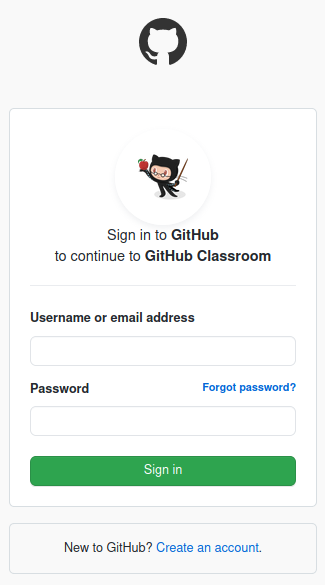

Após o *Sign in* (ou já logado), você receberá a seguinte mensagem:

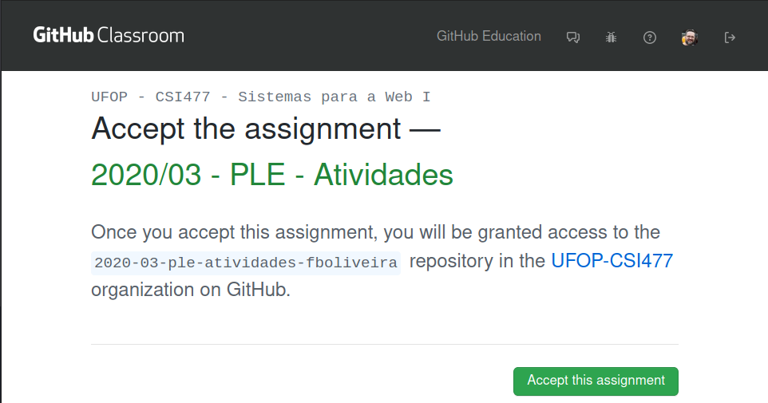

Quando você clicar em *Accept this assignment*, um processo será realizado e uma imagem similar a seguinte aparecerá na tela:

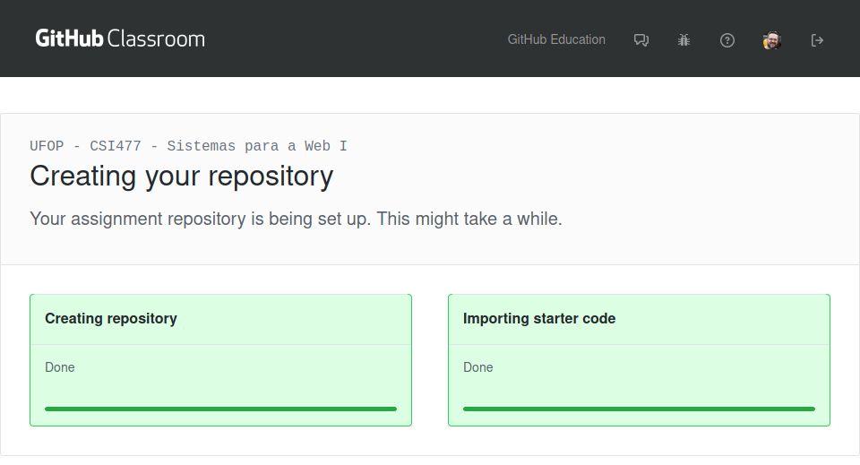

Ao final do processo, a seguinte mensagem será apresentada:

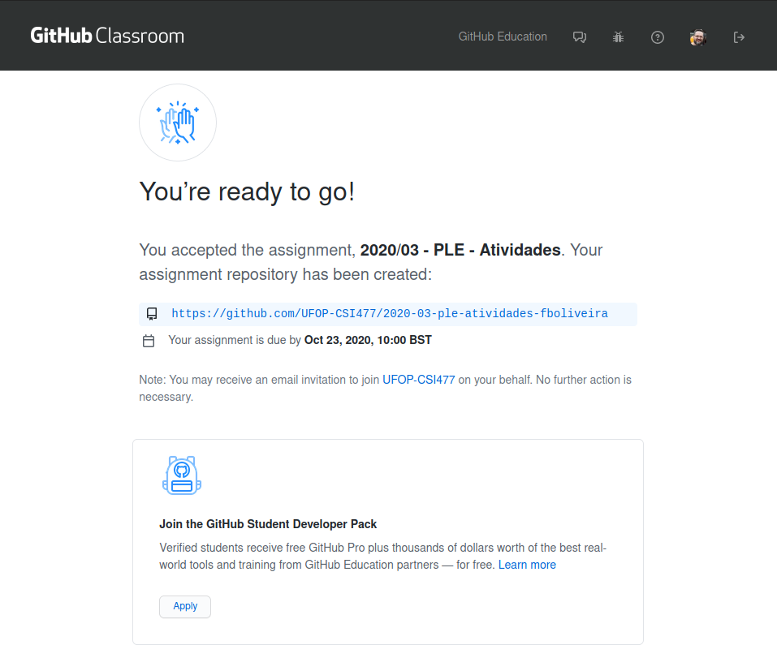

O endereço do repositório criado é iniciado por ``2020-03-ple-atividades`` (``csi606-2023-01-atividades``) e tem ao final o seu usuário no GitHub. Para o meu usuário, foi criado o seguinte repositório:

```html
https://github.com/UFOP-CSI477/2020-03-ple-atividades-fboliveira
```

Observe que ele é criado dentro da organização ```UFOP-CSI477```. Assim, é possível verificar todas as atividades que você realizar, pois elas estão vinculadas pelo *Classroom*. Você pode receber um e-mail com o convite para se associar à organização. Verifique isso, por favor, na sua conta vinculado ao GitHub.

Ao acessar o endereço do repositório, você verá a seguinte estrutura:

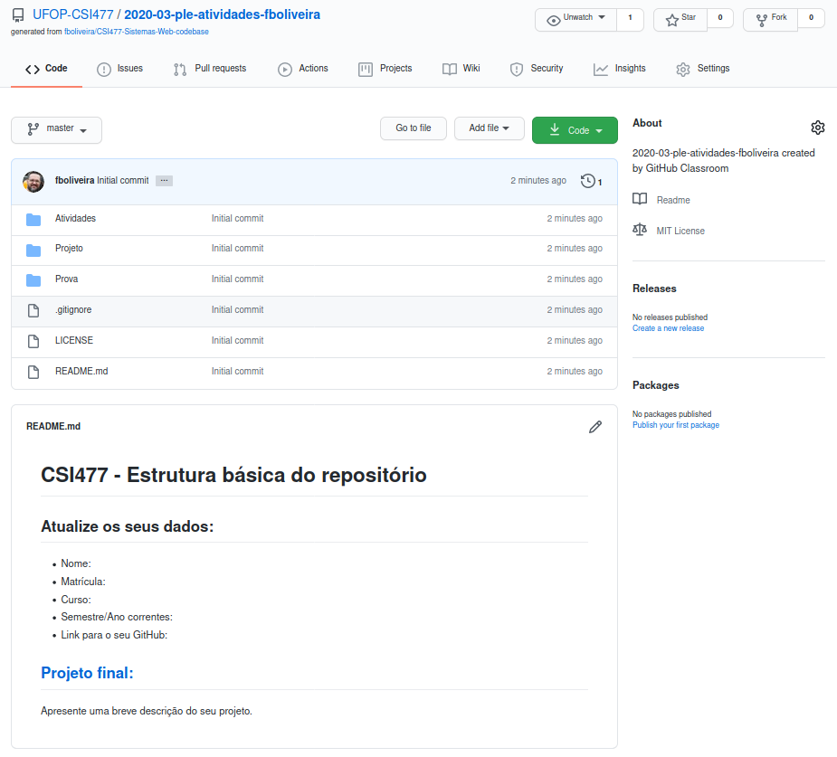

Um *template* com uma sugestão de estrutura de pastas foi utilizado para criar o repositório. Você poderá inserir separadamente as ```Atividades``` (práticas 1 e 2 e os exercícios), o ```Projeto``` e a ```Prova```. O arquivo ```README.md``` da pasta ```Projeto``` já apresenta a estrutura da proposta do trabalho com a indicação das seções a serem descritas.

Como o GitHub não insere no repositório pastas vazias, eu tive que utilizar de um artifício técnico emergencial (~~gambiarra~~) para a criação dessa estrutura. Você encontrará nas pastas um arquivo chamado ```.gitkeep```. Você poderá exclui-los quando for atualizando as pastas.

### Markdown

A extensão ```.md``` representa **Markdown**, a linguagem de marcação utilizada pelo GitHub. Existem referências para Git, GitHub e Markdown nos links disponibilizados [aqui](git-and-github.md).
 Você pode encontrar outros locais em que essa linguagem é utilizada [aqui](https://www.w3.org/community/markdown/wiki/MarkdownImplementations). Arquivos desse tipo são traduzidos para HTML pelo processador Markdown para que eles possam ser exibidos.

Se você inserir em qualquer pasta um  arquivo com o nome ```README.md```, ele será apresentado logo após a lista das pastas e dos arquivos.

O Markdown é uma linguagem com sintaxe leve e prática que permite a construção de textos formatados, sem se preocupar como ele será apresentado.

## Como utilizar o repositório no seu computador

Como o repositório já tem arquivos nele, você precisará baixar esse repositório primeiro para o seu computador para realizar alterações. Se ele estivesse vazio, você poderia realizar o carregamento inicial do repositório de outras maneiras.

Vamos primeiro identificar o link do seu repositório no GitHub. Você pode encontrar esse endereço clicando no botão ```Code``` no seu repositório, destacado em verde, e copiar o endereço, como apresentado na imagem adiante:

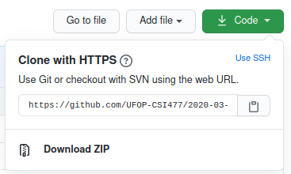

Ele é o mesmo endereço do seu repositório, acrescido da extensão ```.git```. No caso do meu repositório, o endereço é:

```html
https://github.com/UFOP-CSI477/2020-03-ple-atividades-fboliveira.git
```

O endereço será utilizado para clonar o repositório localmente, e para indicar em qual repositório no GitHub ele será atualizado. Veja como fazer o clone pelo terminal [aqui](https://www.git-scm.com/docs/git-clone).

Para fazer o clone do repositório pelo  VSCode, acesse o menu ```View``` > ```Command Palette``` (ou ```Ctrl+Shift+P```) e procure por ```Git: Clone```. Veja a seguir:


Ao acessar a opção, uma janela será aberta para que o endereço do repositório seja inserido. Isso é mostrado a seguir:

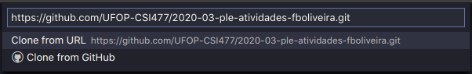

Insira o endereço e aperte ```Enter``` (~~cruze os dedos~~). Neste momento será solicitado um local para baixar o repositório. Selecione uma pasta qualquer no seu computador, como foi feito a seguir. Uma pasta com o nome do repositório (```2020-03-ple-atividades-fboliveira```) será criada na pasta que foi selecionada.

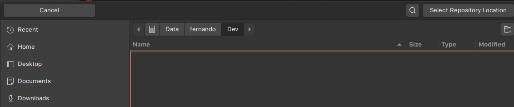

Se tudo correr como esperado (~~em condições normais de temperatura e pressão, desprezando atrito~~), quando o processo terminar, o VSCode perguntará se você quer abrir o repositório que foi clonado:

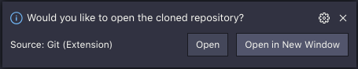

Ao abrir o repositório clonado, você verá uma estrutura similar a esta:

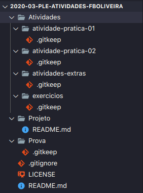

Pelo gerenciador de arquivos do seu sistema operacional, você poderá também verificar a pasta criada:

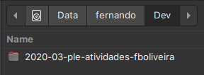

Parabéns! Estamos caminhando muito bem!


## Atualização dos repositórios local e remoto

É importante observar que o repositório não faz sincronismo *online* da mesma maneira que serviços de armazenamento em nuvem, como o Dropbox, Google Drive e similares. Nós precisamos indicar os arquivos que serão atualizados ([commit](https://git-scm.com/docs/gitglossary#def_commit)) e realizar a atualização do repositório remoto ([push](https://git-scm.com/docs/gitglossary#Documentation/gitglossary.txt-aiddefpushapush)) e local ([pull](https://git-scm.com/docs/gitglossary#def_pull)), se necessário.

Esses processos serão exemplificados a partir da atualização do arquivo ```README.md``` e da inclusão de arquivos na pasta de ```Atividades```.

Algumas modificações no arquivo ```README.md``` foram realizadas, conforme apresentado a seguir. Atualize também seu o arquivo com as suas informações, descrevendo brevemente o que será realizado no seu projeto final.

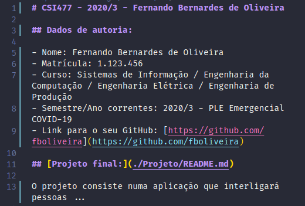

Na pasta de ```Atividades```, as seguintes modificações foram realizadas. Na pasta ```exercicios```, o arquivo ```.gitkeep``` foi excluído. A pasta ```exercicio-01``` foi criada e o arquivo ```introducao.html``` foi inserido. Uma outra pasta e uma imagem também foram inseridas (```img/logo-decsi.png```).

Observe o resultado apresentado na imagem a seguir. As inserções estão apresentadas em verde e a alteração no ```README.md``` destacada em azul. Observe também que o ícone do Git, o terceiro do lado esquerdo, tem uma notificação indicando arquivos modificados.

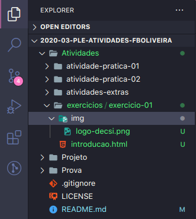

Ao clicar no ícone, você verá uma lista como apresentado adiante. Observe todas as modificações realizadas.

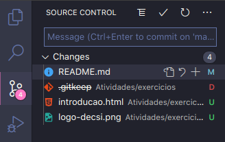

Neste momento, nós prepararemos os arquivos que serão atualizados e realizar o ```commit```. É recomendável associar os arquivos num *commit* de modo semântico. Por exemplo, se você fizer diferentes modificações na interface, na camada de controle e na camada de banco de dados (modelo), é interessante enviá-las agrupando os arquivos pelo contexto de modificação.

No nosso exemplo, é possível enviar a atualização do ```README.md``` e a inclusão do exercício 01 em *commits* diferentes. Para fazer isso, se você passar o mouse pelos arquivos, um símbolo de (+) aparecerá na frente de cada um deles. Veja isso a seguir:

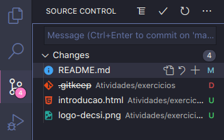

Ao clicar no (+), o arquivo ```README.md``` é inserido na seção ```Staged Changes```, como apresentado na imagem a seguir. Você pode adicionar quantos arquivos forem necessários (ou todos de uma vez só). Uma breve mensagem para descrever a atualização também foi inserida. É importante que a mensagem seja objetiva e coerente com o que está sendo realizado.

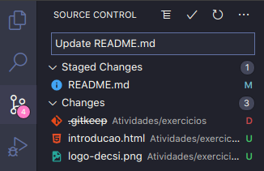

Se você clicar no ícone (:white_check_mark:) ou apertar ```Ctrl+Enter```, o *commit* será realizado. Mas, e o GitHub, será que ele também receberá a atualização?! Verifique se o seu repositório foi atualizado.

Por padrão no VSCode, não. Ele não realiza o ```push``` automaticamente após o ```commit```.


Se você observar na barra de status no lado inferir esquerdo, você terá uma imagem similar a esta:

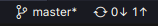

Ao lado do ícone do Git, você verá a palavra ```master```. Esta informação representa o [branch](https://git-scm.com/docs/gitglossary#Documentation/gitglossary.txt-aiddefbranchabranch) corrente, ou seja, a linha histórica de desenvolvimento que será atualizada. Nesse caso, [master](https://git-scm.com/docs/gitglossary#Documentation/gitglossary.txt-aiddefmasteramaster) é a linha principal. Você pode criar diferentes *branchs* (para versões diferentes ou testar mudanças sensíveis em alguma funcionalidade, por exemplo) e depois fazer o [merge](https://git-scm.com/docs/gitglossary#Documentation/gitglossary.txt-aiddefmergeamerge) para o *branch master*.

O círculo com as setas representa o sincronismo dos repositórios, remoto e local. Os números, 0 e 1 nesse caso, representam as atualizações remotas e locais disponíveis. Se você clicar nesse local, o VSCode fará esse sincronismo.

Você pode continuar fazendo esse processo manualmente ou configurar na extensão para que o sincronismo seja realizado após o ```commit``` automaticamente.

Acesse o menu ```View``` > ```Command Palette``` (ou ```Ctrl+Shift+P```) e procure por ```Preferences: Open User Settings```. Abra do lado esquerdo as ```Extensions``` e procure por Git. Nas opções de configuração do lado direito, procure por ```Git: Post Commit Command```. O resultado é apresentado a seguir:


Essa configuração determina a ação que será realizada quando o ```commit``` for concluído com sucesso. A opção ```none``` é o padrão, e nada é realizado.  A opção ```push``` só faz a atualização dos itens locais para o repositório remoto. A opção ```sync``` faz ambas ações, sincronizando local e remotamente. Essa última opção é interessante se você, por exemplo, trabalhar em equipe, em que muitas pessoas podem fazer atualizações. Ou ainda, se você utiliza mais de um computador e faz a atualização de diferentes locais, ou faz modificações pela Web diretamente no GitHub.

Após definir a configuração, os outros arquivos foram adicionados ao *commit* com a mensagem *Update Exercício 01*. O sincronismo foi realizado e os resultados são apresentados a seguir. Você pode verificar isso também no repositório remoto.

O arquivo ```README.md``` com as informações que foram atualizadas pode ser encontrado adiante.

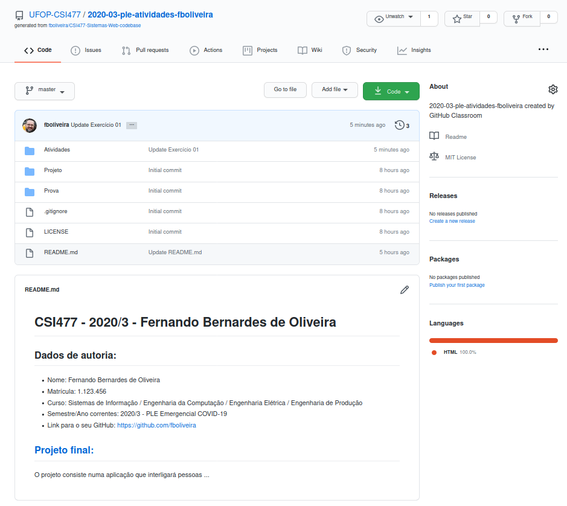

A pasta ```exercicio-01``` criada, os arquivos postados como atividade são mostrados a seguir.

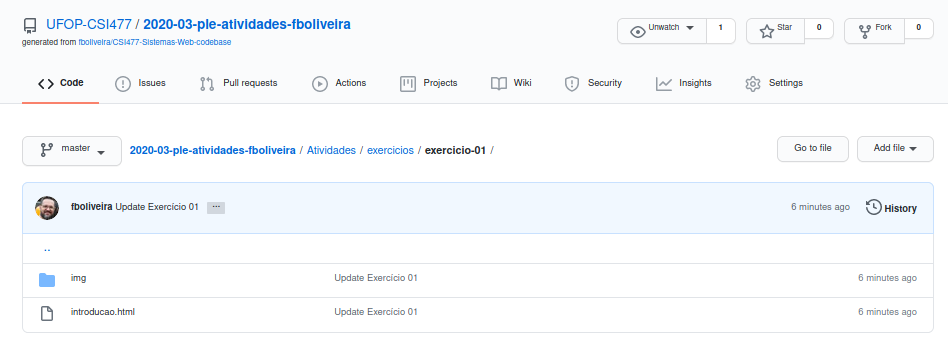

Pronto! Agora você já pode trabalhar com controle de versão de maneira profissional.


## Considerações finais

Você consegue realizar todas essas ações por meio de linha de comando no terminal. Eu sugiro que você conheça isso também para entender o que as operações realizadas visualmente representam. Você pode encontrar um resumo com os comandos em [GitHub - Git cheat sheet](https://education.github.com/git-cheat-sheet-education.pdf).

Você pode contribuir com esse roteiro, seja com correções no texto, indicação de outros processos e tudo mais, me enviando um e-mail ou a partir de uma *issue* ou *pull request*. Veja sobre isso [aqui](https://docs.github.com/en/desktop/contributing-and-collaborating-using-github-desktop/creating-an-issue-or-pull-request). Todas as contribuições são muito bem-vindas!

Muito obrigado!

**Eu desejo um ótimo curso! E que a Força esteja com você!**
